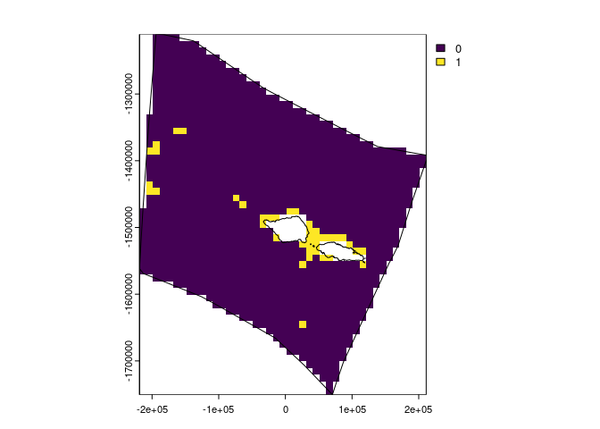

<!-- README.md is generated from README.Rmd. Please edit that file -->
<!-- badges: start -->

[](https://github.com/emlab-ucsb/spatialgridr/actions/workflows/R-CMD-check.yaml)
<!-- badges: end -->

# spatialgridr <a href="https://emlab-ucsb.github.io/spatialgridr/"></a>

`spatialgridr` provides functions for gridding spatial data; i.e. taking
raw spatial data and getting that data into a grid.

This package is still under development. Feel free to submit an issue
with bugs or suggestions.

## Installation

You can install the development version of `spatialgridr` from GitHub
with:

``` r
# install.packages("devtools")
devtools::install_github("emlab-ucsb/spatialgridr")
```

`spatialgridr` has two functions:

- `get_grid()`: for creating a spatial grid
- `get_data_in_grid()`: for gridding spatial data

## Example

This shows how to obtain a spatial grid and grid some data using that
grid.

We can obtain grids in raster (`terra::rast`) or vector (`sf`) format.
First we need a polygon that we want to create a grid for. In this
example we will use the exclusive economic zone (EEZ) of Samoa. We also
need to provide a suitable projection for the area we are interested in,
<https://projectionwizard.org> is useful for this purpose. For spatial
planning, equal area projections are normally best.

``` r
#load Samoa EEZ
samoa_eez <- readRDS(system.file("extdata", "samoa_eez.rds", package = "spatialgridr"))

#equal area projection for Samoa obtained from https://projectionwizard.org
samoa_projection <- '+proj=laea +lon_0=-172.5 +lat_0=0 +datum=WGS84 +units=m +no_defs'

# Create a raster grid with 10km sized cells
planning_grid <- get_grid(area_polygon = samoa_eez, projection_crs = samoa_projection, resolution = 10000)

#plot the grid
terra::plot(planning_grid)
terra::lines(terra::as.polygons(planning_grid, dissolve = FALSE)) #add the outlines of each cell
```


To obtain a grid in `sf` format we can use arguments
`option = "sf_square"` or `option = "sf_hex"` in `get_grid` to specify
square or hexagonal cells. We will create and plot a hexagonal grid with
10 km wide cells.

``` r
planning_grid_sf <- get_grid(area_polygon = samoa_eez, projection_crs = samoa_projection, resolution = 10000, option = "sf_hex")

plot(planning_grid_sf)
```


Now we can grid some data. Data can be in raster (`terra::rast()`) or
`sf` format. Here’s an example using global data mapping knolls (small
seamounts) which is in `sf` format:

``` r
# knolls data for area of Pacific
knolls <- readRDS(system.file("extdata", "ridges.rds", package = "spatialgridr"))

#grid the data
knolls_gridded <- get_data_in_grid(spatial_grid = planning_grid, dat = knolls)

#plot
terra::plot(knolls_gridded)
terra::lines(samoa_eez |> sf::st_transform(crs = samoa_projection)) #add Samoa's EEZ
```


And another example using raster data, in this case global cold water
coral distribution data which has been pre-cropped to the Pacific

``` r
#load cold water coral data
cold_coral <- terra::rast(system.file("extdata", "cold_coral.tif", package = "spatialgridr"))

#grid the data
coral_gridded <- get_data_in_grid(spatial_grid = planning_grid, dat = cold_coral)

#plot
terra::plot(coral_gridded)
terra::lines(samoa_eez |> sf::st_transform(crs = samoa_projection)) #add Samoa's EEZ
```



We can also use the sf grid we created to return data in sf format:

``` r
#grid the data
knolls_gridded_sf <- get_data_in_grid(spatial_grid = planning_grid_sf, dat = knolls)

#plot
plot(knolls_gridded_sf)
```


