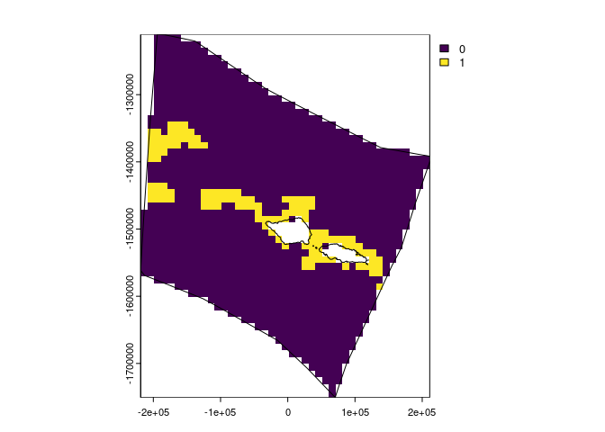
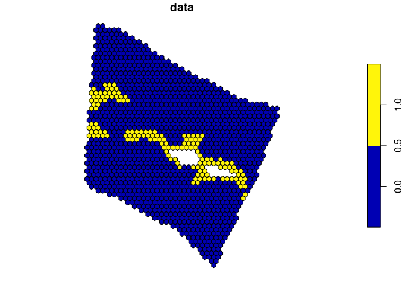
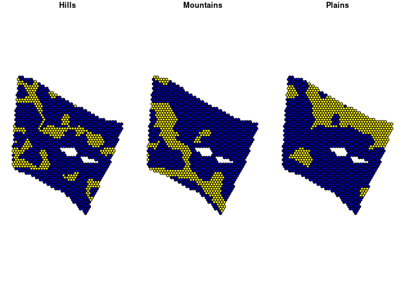
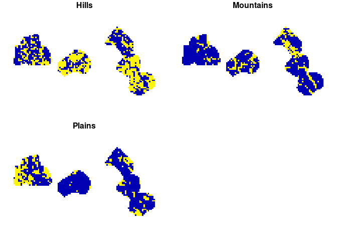
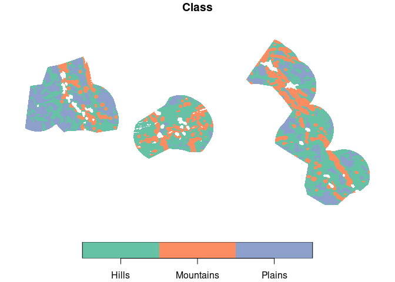
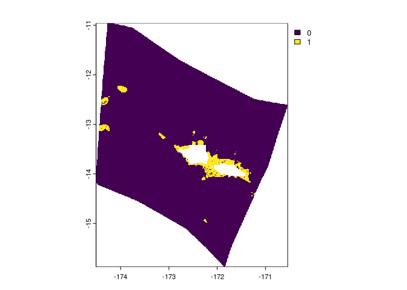

<!-- README.md is generated from README.Rmd. Please edit that file -->
<!-- badges: start -->

[](https://github.com/emlab-ucsb/spatialgridr/actions/workflows/R-CMD-check.yaml)
<!-- badges: end -->

# spatialgridr <a href="https://emlab-ucsb.github.io/spatialgridr/"></a>

`spatialgridr` provides functions for gridding spatial data; i.e. taking
raw spatial data and getting that data into a grid.

This package is still under development. Feel free to submit an issue
with bugs or suggestions.

## Installation

You can install the development version of `spatialgridr` from GitHub
with:

``` r
# install.packages("remotes")
remotes::install_github("emlab-ucsb/spatialgridr")
```

`spatialgridr` has three functions:

- `get_boundary()`: retrieves the boundaries for a marine or terrestrial
  area, such as a country or Exclusive Economic Zone (EEZ)
- `get_grid()`: creates a spatial grid
- `get_data_in_grid()`: grids spatial data; can also be used to crop/
  intersect a polygon with data

## Examples

This shows how to obtain a spatial grid and grid some data using that
grid.

``` r
#load the package
library(spatialgridr)
```

## Get a boundary

We can obtain grids in raster (`terra::rast`) or vector (`sf`) format.
First we need a polygon that we want to create a grid for. We can
retrieve boundaries for countries, Exclusive Economic Zones (EEZs),
oceans, and several other jurisdiction types using `get_boundary()`. In
this example we will get the EEZ for the Pacific island of Samoa.

``` r
#get Samoa's EEZ
samoa_eez <- get_boundary(name = "Samoa")

plot(samoa_eez["geometry"], axes = TRUE)
```


## Get a grid

We also need to provide a suitable projection for the area we are
interested in, <https://projectionwizard.org> is useful for this
purpose. For spatial planning, equal area projections are normally best.

``` r
#equal area projection for Samoa obtained from https://projectionwizard.org
samoa_projection <- '+proj=laea +lon_0=-172.5 +lat_0=0 +datum=WGS84 +units=m +no_defs'

# Create a raster grid with 10km sized cells
samoa_grid <- get_grid(boundary = samoa_eez, resolution = 10000, crs = samoa_projection)

#plot the grid
terra::plot(samoa_grid)
terra::lines(terra::as.polygons(samoa_grid, dissolve = FALSE)) #add the outlines of each cell
```


To obtain a grid in `sf` format we can use arguments
`option = "sf_square"` or `option = "sf_hex"` in `get_grid` to specify
square or hexagonal cells. We will create and plot a hexagonal grid with
10 km wide cells.

``` r
samoa_grid_sf <- get_grid(boundary = samoa_eez, resolution = 10000, crs = samoa_projection, output = "sf_hex")

plot(samoa_grid_sf)
```


## Grid data

Now we can grid some data. Data can be in raster (`terra::rast()`) or
`sf` format. Here’s an example using a global map of seafloor ridges
which is in `sf` format:

``` r
# ridges data for area of Pacific
ridges <- readRDS(system.file("extdata", "ridges.rds", package = "spatialgridr"))

#grid the data
ridges_gridded <- get_data_in_grid(spatial_grid = samoa_grid, dat = ridges)

#plot
terra::plot(ridges_gridded)
terra::lines(samoa_eez |> sf::st_transform(crs = samoa_projection)) #add Samoa's EEZ
```



And another example using raster data, in this case global cold water
coral distribution data which has been pre-cropped to the Pacific

``` r
#load cold water coral data
cold_coral <- terra::rast(system.file("extdata", "cold_coral.tif", package = "spatialgridr"))

#grid the data
coral_gridded <- get_data_in_grid(spatial_grid = samoa_grid, dat = cold_coral)

#plot
terra::plot(coral_gridded)
terra::lines(samoa_eez |> sf::st_transform(crs = samoa_projection)) #add Samoa's EEZ
```


We can also use the sf grid we created to return gridded data in sf
format:

``` r
#grid the data
ridges_gridded_sf <- get_data_in_grid(spatial_grid = samoa_grid_sf, dat = ridges)

#plot
plot(ridges_gridded_sf)
```



We can also grid `sf` data that contains multiple data features, such as
habitat types. To do this, we provide the name of the column that as the
`feature_names` argument in `get_data_data_in_grid()`. This creates a
multi-layer grid. For raster data this means multiple raster layers and
for `sf` grids multi-column objects. Here’s an example using `sf` data
that classifies the worlds deep oceans (Abyssal plains) into 3
categories:

``` r
#load the data
abyssal_plains <- system.file("extdata", "abyssal_plains.rds", package = "spatialgridr") |>
  readRDS()

#grid the data
abyssal_plains_sf <- get_data_in_grid(spatial_grid = samoa_grid_sf, dat = abyssal_plains, feature_names = "Class")

#plot
plot(abyssal_plains_sf)
```



`spatialgridr` also works with grids that cross the antimeridian
(international date line). You can set `antimeridian = TRUE` in
`get_data_in_grid` if you know you are using a grid that crosses the
antimeridian, or if `antimeridian = NULL` (the default option), the
function will automatically determine if the grid crosses the
antimeridian. Here’s an example using Kiribati’s EEZ as the grid area.

``` r
#load the Kiribati EEZ polygon
kir_eez <- get_boundary(name = "Kiribati", country_type = "sovereign")

#create a grid for the Kiribati EEZ - Equal area projection obtained from https://projectionwizard.org
kir_grid <- get_grid(boundary = kir_eez, resolution = 50000, crs = '+proj=laea +lon_0=-159.609375 +lat_0=0 +datum=WGS84 +units=m +no_defs', output = "sf_square")

#get abyssal plains classification for Kiribati grid
kir_abyssal_plains <- get_data_in_grid(spatial_grid = kir_grid, dat = abyssal_plains, feature_names = "Class")
#> Spherical geometry (s2) switched off
#> although coordinates are longitude/latitude, st_intersection assumes that they
#> are planar
#> Warning: attribute variables are assumed to be spatially constant throughout
#> all geometries
#> Spherical geometry (s2) switched on
#> Warning: attribute variables are assumed to be spatially constant throughout
#> all geometries
#> Warning: attribute variables are assumed to be spatially constant throughout
#> all geometries
#> Warning: attribute variables are assumed to be spatially constant throughout
#> all geometries
#> Warning: attribute variables are assumed to be spatially constant throughout
#> all geometries
```

``` r

#plot
plot(kir_abyssal_plains, border = FALSE)
```



## Get raw data

If you just want to get data for an area, but don’t want to grid it, you
can provide an `sf` polygon to `get_data_in_grid()` and set
`raw = TRUE`.

``` r
kir_abyssal_plains_raw <- get_data_in_grid(spatial_grid = kir_eez, dat = abyssal_plains, raw = TRUE)
#> Warning: attribute variables are assumed to be spatially constant throughout
#> all geometries
```

``` r

#shift longitude to make it easier to view data
plot(kir_abyssal_plains_raw[1] %>% sf::st_shift_longitude(), border = FALSE)
```



``` r
samoa_coral_raw <- get_data_in_grid(spatial_grid = samoa_eez, dat = cold_coral, raw = TRUE)

terra::plot(samoa_coral_raw)
```


